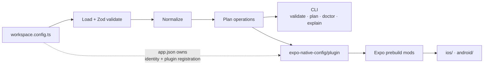

# Expo Native Config

[](https://www.npmjs.com/package/expo-native-config)
[](LICENSE)

An Expo Config Plugin and CLI that lets you declare native project changes in a typed `workspace.config.ts`, review them as a plan, and apply them through `expo prebuild` — iOS extensions, Swift packages, CocoaPods, Xcode schemes and build settings, Android Gradle structure, manifest entries and resources.

It replaces the hand-written config plugin: instead of a `withPodfile` mod doing string surgery on generated Ruby, you write a field, a schema rejects it if it's wrong, and `plan` shows you every operation before prebuild runs.

## 🚀 How to use

Requires Node.js 22.14+, Expo SDK 50–57, and a development build (Expo Go cannot host custom native targets).

1. **Install** into an existing Expo app:

   ```sh
   npx expo install expo-native-config
   ```

2. **Create a config.** Pick a starter — `minimal` writes only the config, the others write real native source you can edit:

   ```sh
   npx expo-native-config init --template share-extension --yes
   ```

3. **Register the plugin** in your `app.json`, last in the existing array:

   ```json
   { "expo": { "plugins": ["expo-router", "expo-native-config/plugin"] } }
   ```

   This is the step people skip, and skipping it means prebuild silently applies nothing.

4. **Declare something** in `workspace.config.ts`, then check it:

   ```sh
   npx expo-native-config validate   # schema errors, by field name
   npx expo-native-config plan       # every operation, with the field it came from
   npx expo-native-config doctor     # environment + escape-hatch warnings
   ```

5. **Generate** the native projects:

   ```sh
   npx expo prebuild --platform ios
   ```

6. **Build it.** `npx expo run:ios` or `npx expo run:android`. A JS reload does not apply native changes — you need a new native build.

[Getting started](docs/getting-started.md) walks the same seven steps with a "what you should see" check after each one.

## How it works

The root `workspace.config.ts` is the magic file. It lives beside `app.json`, never at a monorepo root, and it owns native _structure_; `app.json` keeps owning app _identity_ — name, slug, bundle identifier — and the plugin registration.

Loading and validation happen once, in a session the CLI and the config plugin share. That's why what `plan` prints is what prebuild applies: both read the same normalized config through the same generators. Generators describe named operations; executors apply them through Expo's own config-plugin mods.

Everything written into a generated file goes inside a **tagged block**. Running prebuild again updates that block instead of appending a second copy, and deleting a declaration emits a removal operation for its tag rather than leaving the change behind.



## What a plan looks like

`plan` is the thing worth seeing before anything else. Real output from the [share-extension sample](apps/share-extension):

```console
$ npx expo-native-config plan

✓ Native intent plan — apps/share-extension/workspace.config.ts
  ios.podfileProperties             ios:podfileProperties
  target:WorkspaceShare:infoPlist   target:WorkspaceShare:Info.plist
  target:podfileLoader              targetsPodfileLoader
  target:all                        targets
  xcode.embedCycle                  fixEmbedCycle
  ios.buildSettings                 ios:buildSettings
  ios.runScripts                    ios:runScripts
7 declared operations (+6 cleanup, use --verbose). Preview only; native state is not compared.
```

Left column is the operation ID, right column is the config field it came from. `explain --id ios.runScripts` prints that operation's kind, source field and desired state; `--json` gives the same for CI.

A plan is intent. It does not diff the existing native project, and it does not prove a native build succeeds.

## The config file

`workspace.config.ts` (or `.js`, or `.json`) has three top-level fields — `schemaVersion`, `ios` and `android` — and no `expo` wrapper. Every field below is optional.

```ts
import {
  Abi,
  AndroidApplication,
  AndroidComponent,
  AndroidDependency,
  AndroidFeature,
  AndroidModule,
  BuildConfigField,
  MavenRepository,
  Package,
  Pod,
  PodBuildSettings,
  RunScript,
  Scheme,
  SwiftPackageRequirement,
  Target,
  XcodeBuildSettings,
  defineWorkspace,
} from 'expo-native-config';

export default defineWorkspace({
  schemaVersion: 1,

  ios: {
    // App extensions. Four ways to include one — see "iOS targets" below.
    targets: [
      Target.share({
        name: 'WorkspaceShare',
        source: './targets/WorkspaceShare', // defaults to targets/<name>
        bundleIdentifier: '.share', // leading dot appends to the host bundle ID
        deploymentTarget: '18.0',
        entitlements: { 'com.apple.security.application-groups': ['group.com.example.app'] },
        frameworks: ['SwiftUI'],
      }),
    ],
    targetsRoot: './targets', // where bare target names are discovered
    deploymentTarget: '15.1',

    // Swift packages — remote with a version requirement, or local by path.
    packages: [
      Package.remote(
        'https://github.com/apple/swift-log',
        SwiftPackageRequirement.upToNextMajor('1.0.0'),
        ['Logging'],
      ),
      Package.local('../native/WorkspaceMath', ['WorkspaceMath']),
    ],
    // CocoaPods, and build settings applied to pod targets by name prefix.
    pods: [Pod.local('WorkspaceGreeting', '../native/WorkspaceGreeting')],
    podBuildSettings: [
      PodBuildSettings.forTargetsStartingWith('NativeMedia', {
        CLANG_ALLOW_NON_MODULAR_INCLUDES_IN_FRAMEWORK_MODULES: 'YES',
      }),
    ],
    autolinkingExclude: ['expo-dev-client'],

    // Host app target.
    buildSettings: XcodeBuildSettings.of({ ldExportSymbols: false }),
    runScripts: [RunScript.shell('Sample Script', 'echo hello')],
    resources: ['./assets/native/Config.plist'],
    schemes: [Scheme.debug('Development', { archive: 'Release' })],
    fixExtensionEmbedCycle: true,

    // Podfile.properties.json — the mechanism Expo documents as safe.
    podfileProperties: { 'expo.jsEngine': 'hermes' },
    podfileGlobals: { use_frameworks: 'static' },
    minimumPodDeploymentTarget: '15.1',
    xcode: { env: { exports: { NODE_BINARY: '/usr/bin/node' } } },

    // Escape hatch — rewrites generated Ruby. Warned about by plan and doctor.
    podfile: { postInstall: ["Pod::UI.puts 'hello'"], replace: [] },
  },

  android: {
    // Gradle structure.
    minSdkVersion: 24,
    compileSdkVersion: 35,
    kotlinVersion: '2.0.21',
    dependencies: [AndroidDependency.library('androidx.collection:collection-ktx:1.4.5')],
    mavenRepositories: [MavenRepository.url('https://jitpack.io')],
    buildscriptDependencies: ['com.google.gms:google-services:4.4.2'],
    plugins: ['com.google.gms.google-services'],
    forceDependencies: ['androidx.core:core-ktx:1.13.1'],
    modules: [AndroidModule.at(':shared', '../shared')],
    gradleProperties: { 'org.gradle.parallel': true },
    buildConfigFields: [BuildConfigField.string('WORKSPACE_TAG', 'sample')],
    abiFilters: [Abi.arm64],
    lint: { abortOnError: false },
    signing: { propertiesFile: './release.properties', optional: true },

    // AndroidManifest.
    features: [AndroidFeature.optional('android.hardware.camera')],
    applicationAttributes: AndroidApplication.attributes({ largeHeap: true }),
    metaData: { 'com.example.SAMPLE_KEY': 'demo' },
    components: [
      AndroidComponent.remove('receiver', 'androidx.profileinstaller.ProfileInstallReceiver'),
    ],
    queries: { intents: [{ action: 'android.intent.action.VIEW', scheme: 'geo' }] },
    manifestPlaceholders: { redirectScheme: 'com.example.app' },
    supportsScreens: { largeScreens: true },

    // res/.
    strings: { sample_value: 'hello from workspace.config.ts' },
    colors: { sample_accent: '#F09458' },
    styles: [],
    resources: [{ path: 'xml/network_security_config.xml', contents: '<?xml version="1.0"?>...' }],

    // Escape hatch — rewrites generated Groovy.
    gradle: { app: [], project: [] },
  },
});
```

Declarations can be written as plain objects or built with constructors — `Target.share(…)`, `AndroidDependency.project(…)`, `XcodeBuildSettings.of({ ldExportSymbols: false })`. The constructors supply the discriminants, the Xcode and `android:` key names, and the defaults, so the config carries fewer magic strings. Both styles validate identically; JSON configs use the object form.

The [configuration reference](docs/configuration.md) documents every field with its path base and validation boundary; the [recipes](docs/recipes.md) show twelve complete configurations.

## iOS targets

Supported extension types:

| Type                   | Description                    |
| ---------------------- | ------------------------------ |
| `share`                | Share Extension                |
| `widget`               | Widget / Live Activity         |
| `clip`                 | App Clip                       |
| `notification-service` | Notification Service Extension |
| `notification-content` | Notification Content Extension |
| `intent`               | Siri Intent Extension          |
| `action`               | Share Action                   |
| `safari`               | Safari Extension               |

Declaring a target does not write its Swift source. Outside `init`, that source is yours to provide — an extension with no implementation compiles into an extension that does nothing.

There are four ways to include one, and [docs/targets.md](docs/targets.md) covers each in full:

```ts
ios: {
  targets: [
    // 1. Inline — type and settings here, source at targets/<name>.
    Target.widget({ name: 'WorkspaceWidget', bundleIdentifier: '.widget' }),

    // 2. Discovered — a bare name; targetsRoot/<name>/target.config.js describes it.
    'WorkspaceWidget',

    // 3. By path — any folder carrying a target.config.js, anywhere in the repo.
    { path: '../../shared/targets/Widget', name: 'WorkspaceWidget', bundleIdentifier: '.widget' },

    // 4. From a package — a workspace package ships the target; the app names its bundle ID.
    { package: 'workspace-widget-target', name: 'WorkspaceWidget', bundleIdentifier: '.widget' },
  ],
}
```

A leading dot in `bundleIdentifier` appends to the host app's — `.widget` under `com.example.app` becomes `com.example.app.widget`. Extension source must stay inside the app package; dependency paths resolve from the generated `ios/`, extension source paths from the app root.

## CLI

| Command              | Does                                                              |
| -------------------- | ----------------------------------------------------------------- |
| `init`               | Write a starter config. Refuses to overwrite; not a merge command |
| `migrate`            | Propose a config from an existing app and its plugins             |
| `validate`           | Schema-check the config, naming the exact field                   |
| `plan`               | List every operation with the field it came from                  |
| `doctor`             | Environment checks and escape-hatch warnings                      |
| `explain --id <op>`  | Kind, source field and desired state for one operation            |
| `completion [shell]` | Shell completion for `bash`, `zsh` or `fish`                      |

Inspection commands accept `--project <directory>`, `--config <file>`, `--json` and `--verbose`. `doctor --ci` runs the same diagnostics without a terminal. `init` needs `--yes` and `migrate` needs `--dry-run` when there is no interactive terminal.

`--config <file>` selects a custom filename and must be set in **both** the CLI and the Expo plugin, or the two will read different files.

| Exit code | Meaning                                    |
| --------- | ------------------------------------------ |
| 0         | Success                                    |
| 1         | Invalid configuration or command arguments |
| 2         | Unexpected tool failure                    |

### Already have config plugins?

`migrate --dry-run` reads your Expo config, your local plugins and your generated native directories, and proposes a manifest without writing anything:

```sh
npx expo-native-config migrate --dry-run
```

It extracts what it can read unambiguously, leaves alone anything an Expo template or a published plugin already owns, and — for each local plugin — names the workspace field that replaces it. It does not translate plugin JavaScript, and it says so rather than pretending otherwise. See [migrating an existing app](docs/migrate.md).

## Templates

| Template           | Generated files                                             | Purpose                                                                                         |
| ------------------ | ----------------------------------------------------------- | ----------------------------------------------------------------------------------------------- |
| `minimal`          | `workspace.config.ts`                                       | Compose any supported capabilities yourself                                                     |
| `share-extension`  | Config + `targets/ShareExtension/ShareViewController.swift` | Starting share controller; implement attachment handling and persistence                        |
| `widget`           | Config + `targets/WorkspaceWidget/WorkspaceWidget.swift`    | Static small WidgetKit widget; implement real data and refresh                                  |
| `android`          | Config with camera permission and optional camera feature   | Manifest example; implement runtime permissions and UI                                          |
| `lifecycle-module` | Config + a local Expo module under `modules/startup`        | Run code at launch through Expo lifecycle hooks, without editing AppDelegate or MainApplication |

These five presets are starting points, not the capability list — App Clips, Swift packages, schemes and every Android field are supported without a preset. `init` does not create an Expo app or register its own plugin, and cannot merge into an existing config. See [templates](docs/templates.md).

## Escape hatches

Where nothing typed can express a change, `ios.podfile` and `android.gradle` rewrite generated Ruby and Groovy directly. They are planned with `risk: "escape-hatch"`, listed by `plan --verbose` and warned about by `doctor` — because Expo's own guidance is that rewriting generated code breaks silently across SDK upgrades:

```console
warning: ios.podfile.postInstall edits generated native source directly (ios.podfile.postInstall).
         Re-verify it after an Expo SDK upgrade.
```

A warning here is worth reading rather than clearing.

## Why not a hand-written config plugin

Every Expo app eventually needs a native change `app.json` cannot express, and the answer is always the same: a plugin doing string surgery on a generated file.

```ts
// before — src/plugins/withPodBuildSetting.ts, plus a line in app.config.ts
const withPodBuildSetting: ConfigPlugin = (config) =>
  withPodfile(config, (podfileConfig) => {
    const { contents } = podfileConfig.modResults;
    if (contents.includes(MARKER)) return podfileConfig; // idempotency, by hand
    const postInstall = 'post_install do |installer|';
    if (!contents.includes(postInstall)) throw new Error('no post_install hook to patch');
    podfileConfig.modResults.contents = contents.replace(postInstall, `${postInstall}\n${PATCH}`);
    return podfileConfig;
  });
```

```ts
// after — workspace.config.ts
podBuildSettings: [
  PodBuildSettings.forTargetsStartingWith('NativeMedia', {
    CLANG_ALLOW_NON_MODULAR_INCLUDES_IN_FRAMEWORK_MODULES: 'YES',
  }),
],
```

The difference is not length. The plugin file is untyped, unplanned and unverified: nothing tells you it ran, nothing tells you what it will change before it changes it, and nothing tells you when an SDK upgrade stopped its regular expression from matching.

|                     | Hand-written config plugin                            | Declaration                                                       |
| ------------------- | ----------------------------------------------------- | ----------------------------------------------------------------- |
| Invalid input       | Fails during prebuild, or silently does nothing       | Rejected by `validate` before prebuild runs                       |
| Reviewability       | Read the plugin source and guess                      | `plan` lists each operation with the field it came from           |
| Repeat prebuild     | Duplicate blocks unless you hand-write a marker check | Merges into a tagged block                                        |
| Deleting the change | Edit or delete the plugin, then clean prebuild        | Delete the field; a removal operation drops the tagged block      |
| SDK upgrade         | Regex stops matching, silently                        | Typed fields map onto Expo's own mods                             |
| Risky edits         | Indistinguishable from safe ones                      | `risk: "escape-hatch"`, surfaced by `plan --verbose` and `doctor` |

A dozen of these in one app is a normal amount; the [native-workarounds sample](apps/native-workarounds) shows that dozen as declarations, next to the plugin each one replaces.

## Samples

Every app below is runnable from a checkout — `pnpm install && pnpm build`, then `pnpm --filter @expo-native-config/example-<name> plan`.

| App                                             | Demonstrates                                                    |
| ----------------------------------------------- | --------------------------------------------------------------- |
| [share-extension](apps/share-extension)         | UIKit share sheet with text and URL activation rules            |
| [widget](apps/widget)                           | A SwiftUI / WidgetKit widget shipped by a workspace package     |
| [native-dependencies](apps/native-dependencies) | Source-controlled Swift package and CocoaPod                    |
| [multi-scheme](apps/multi-scheme)               | Debug and Release Xcode schemes                                 |
| [android-gradle](apps/android-gradle)           | Typed Maven dependency and Gradle properties                    |
| [android-manifest](apps/android-manifest)       | Optional camera feature and runtime permission request          |
| [native-workarounds](apps/native-workarounds)   | The plugins apps hand-write, as declarations, with before/after |

## 🤖 AI agent skills

The package bundles three self-contained agent skills (Claude Code, Cursor, Codex) in `skills/`: `expo-native-config` for writing configs, `expo-native-changes` for turning a native requirement into a declaration, and `expo-native-config-maintainer` for working on this repo. Copy the whole folder you want into your agent's skill directory after reviewing it. See [agent skills](docs/agent-skills.md).

## Compatibility and limits

`doctor` errors below Expo SDK 50 and warns above 57, so the CLI stays usable the day a new SDK ships; the samples pin SDK 56. The CLI needs Node.js 22.14+; developing this repo needs Node.js 24.11.1+ and pnpm 10.34.5.

What local verification established: prebuild across all seven samples, unsigned iOS Simulator extension builds, an Android debug APK, one full host-app CocoaPods build, and a tarball consumer check against a fresh `create-expo-app` project. What it did not: interactive widget and share-sheet behavior, physical Android device runs, device signing, and store acceptance. [Compatibility and verification limits](docs/compatibility.md) says what each check does and does not prove.

Config files execute code and must be trusted. Keep signing credentials in environment references or private properties files — environment signing resolves secrets into generated Gradle properties during prebuild, so protect that output.

## Documentation

- [Getting started](docs/getting-started.md) — a seven-step path from install to a verified native change
- [Migrating an existing app](docs/migrate.md) — turn config plugins into declarations with `migrate --dry-run`
- [iOS targets](docs/targets.md) — four ways to include one: inline, discovered, by path, by package
- [Monorepos](docs/monorepos.md) — pnpm, yarn, bun and npm workspaces
- [Configuration reference](docs/configuration.md) — every field
- [Templates](docs/templates.md) and [recipes](docs/recipes.md) — what init generates, and twelve complete configurations
- [Architecture](docs/architecture.md) and [development rules](docs/development-rules.md)
- [Compatibility](docs/compatibility.md) and [verification record](docs/verification.md)
- [Troubleshooting](docs/troubleshooting.md)
- [Release procedure](docs/releasing.md)
- [Agent skills](docs/agent-skills.md)

See [contributing](CONTRIBUTING.md), [security](SECURITY.md), and the [code of conduct](CODE_OF_CONDUCT.md). Licensed under [MIT](LICENSE).
