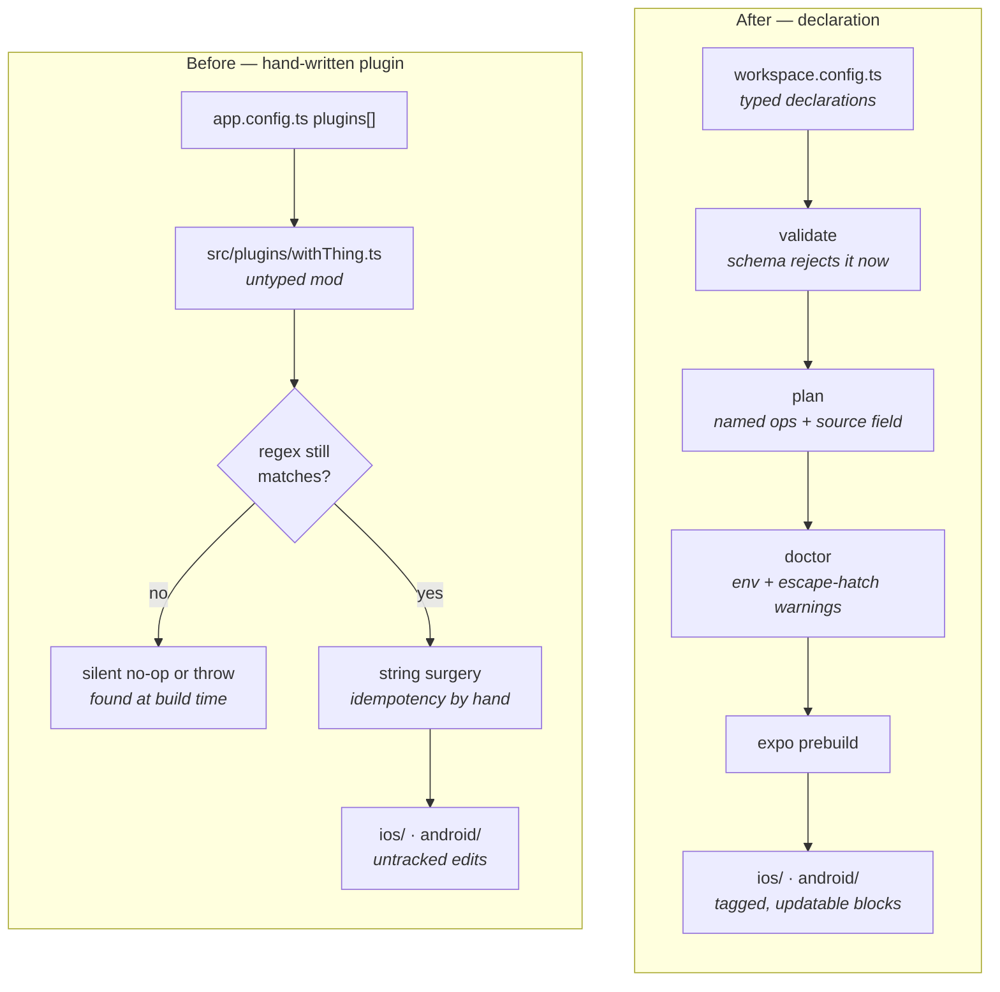
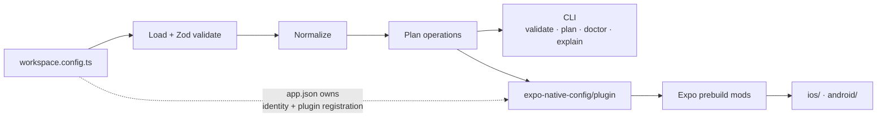

# Expo Native Config

Declare native project changes in `workspace.config.ts`, review a plan, and apply them through Expo prebuild.

One package provides an Expo config plugin, a CLI, typed helpers and agent skills for iOS extensions, Swift packages, CocoaPods, Xcode schemes and build settings, Android Gradle structure, and Android manifest and resource entries.

> **Release status:** unpublished project prepared for release. Registry availability and ownership must be verified before advertising an npm install command. Use the local workspace or a packed tarball for now.

## The problem

Every Expo app eventually needs a native change that `app.json` cannot express, and the answer is always the same: write a config plugin that does string surgery on a generated file.

```ts
// before — src/plugins/withPodBuildSetting.ts, plus a line in app.config.ts
const withPodBuildSetting: ConfigPlugin = (config) =>
  withPodfile(config, (podfileConfig) => {
    const { contents } = podfileConfig.modResults;
    if (contents.includes(MARKER)) return podfileConfig; // idempotency, by hand
    const postInstall = 'post_install do |installer|';
    if (!contents.includes(postInstall)) throw new Error('no post_install hook to patch');
    podfileConfig.modResults.contents = contents.replace(postInstall, `${postInstall}\n${PATCH}`);
    return podfileConfig;
  });
```

```ts
// after — workspace.config.ts
podBuildSettings: [
  PodBuildSettings.forTargetsStartingWith('NativeMedia', {
    CLANG_ALLOW_NON_MODULAR_INCLUDES_IN_FRAMEWORK_MODULES: 'YES',
  }),
],
```

The difference is not length. The plugin file is untyped, unplanned and unverified: nothing tells you it ran, nothing tells you what it will change before it changes it, and nothing tells you when an SDK upgrade stopped its regular expression from matching. A dozen of these in one app is a normal amount; the [native-workarounds sample](apps/native-workarounds) shows that dozen as declarations, next to the plugin each one replaces.

## Before and after



|                     | Hand-written config plugin                            | Declaration                                                       |
| ------------------- | ----------------------------------------------------- | ----------------------------------------------------------------- |
| Invalid input       | Fails during prebuild, or silently does nothing       | Rejected by `validate` before prebuild runs                       |
| Reviewability       | Read the plugin source and guess                      | `plan` lists each operation with the field it came from           |
| Repeat prebuild     | Duplicate blocks unless you hand-write a marker check | Merges into a tagged block                                        |
| Deleting the change | Edit or delete the plugin, then clean prebuild        | Delete the field; a removal operation drops the tagged block      |
| SDK upgrade         | Regex stops matching, silently                        | Typed fields map onto Expo's own mods                             |
| Risky edits         | Indistinguishable from safe ones                      | `risk: "escape-hatch"`, surfaced by `plan --verbose` and `doctor` |

Where nothing typed can express a change, the escape hatches are still there — planned with `risk: "escape-hatch"`, listed by `plan --verbose` and warned about by `doctor`, because Expo's own guidance is that rewriting generated code breaks silently across SDK upgrades.

## What a plan looks like

`plan` is the thing worth seeing before anything else. Real output from the [native-workarounds sample](apps/native-workarounds), trimmed:

```console
$ pnpm --filter @expo-native-config/example-native-workarounds plan

✓ Native intent plan — apps/native-workarounds/workspace.config.ts
warning: ios.podfile.postInstall edits generated native source directly (ios.podfile.postInstall). Re-verify it after an Expo SDK upgrade.
warning: ios.podfile.replace.0 edits generated native source directly (ios.podfile.replace[0]). Re-verify it after an Expo SDK upgrade.
  pod:buildSettings  podBuildSettings
  pod:minimumDeploymentTarget  pods:minimumDeploymentTarget
  ios.autolinkingExclude  podfile:autolinkingExclude
  xcode.embedCycle  fixEmbedCycle
  android.modules  android:modules
  android.receiver.androidx.profileinstaller.ProfileInstallReceiver  android:receiver:androidx.profileinstaller.ProfileInstallReceiver
  android.resource.xml/workspace_network_security_config.xml  android:res:xml/workspace_network_security_config.xml
  android.queries  android:queries
32 declared operations (+4 cleanup, use --verbose). Preview only; native state is not compared.
```

Every line has an ID. `explain --id android.modules` prints the operation kind, the config field it came from, and the desired state. `--json` gives the same result for CI.

A plan describes intended operations; it does not compare every byte of the existing native project or prove that a native build succeeds.

## How it fits together



The CLI and the config plugin share one validated session, so what `plan` prints is what prebuild applies. Generators describe operations; executors apply them through Expo config-plugin mods. See [architecture](docs/architecture.md).

## Try it locally

Repository development requires Node.js 24.11.1 or newer and pnpm 10.34.5. The published CLI supports Node.js 22.14 or newer. Native builds additionally need the platform toolchain.

```sh
pnpm install
pnpm build
pnpm --filter @expo-native-config/example-share-extension validate
pnpm --filter @expo-native-config/example-share-extension plan
pnpm --filter @expo-native-config/example-share-extension prebuild --platform ios --no-install
```

For an existing Expo app, pack the package with `pnpm --filter expo-native-config pack --pack-destination /tmp`, install the resulting `.tgz` using that app's package manager, and run `expo-native-config init --template minimal --yes` through the package manager. Register `expo-native-config/plugin` in your Expo config's `plugins` array. See [getting started](docs/getting-started.md).

```ts
import { defineWorkspace, Target } from 'expo-native-config';

export default defineWorkspace({
  schemaVersion: 1,
  ios: {
    targets: [
      Target.share({
        name: 'WorkspaceShare',
        source: './targets/WorkspaceShare',
        bundleIdentifier: '.share',
      }),
    ],
  },
});
```

Declarations can be written as plain objects or built with constructors — `Target.share(…)`, `AndroidDependency.project(…)`, `XcodeBuildSettings.of({ ldExportSymbols: false })` — which supply the discriminants, the Xcode and `android:` key names, and the defaults, so the config carries fewer magic strings. Both styles validate identically; JSON configs use the object form.

Run `expo-native-config validate`, `plan`, and `doctor` before `expo prebuild`.

The example expects `targets/WorkspaceShare/` to contain native sources. To generate a source-bearing starter instead, use `init --template share-extension --yes` in an app without an existing workspace config. See [all four starter presets](docs/templates.md) for exact files and remaining implementation work. Add Android settings, packages, or schemes to the same manifest as needed; templates do not restrict its capabilities.

## What can be declared

| Area              | Declarations                                                                                                                                                                                            |
| ----------------- | ------------------------------------------------------------------------------------------------------------------------------------------------------------------------------------------------------- |
| iOS targets       | Share, widget, App Clip, notification service, notification content, intent, action and Safari extensions — with entitlements, frameworks, Info.plist, build settings and deployment target             |
| iOS dependencies  | Swift packages (remote and local, with version requirements), CocoaPods, pod build settings by target prefix, removable pod build phases, autolinking exclusions                                        |
| Xcode             | Host-target build settings, run-script build phases, resources, schemes, `.xcode.env` entries, extension embed-cycle fix                                                                                |
| Podfile           | Properties, globals, minimum deployment target, and — as escape hatches — `post_install` and replacement rules                                                                                          |
| Android Gradle    | Maven repositories, flat dirs, classpath and buildscript dependencies, plugins, forced resolutions, local modules, ABI filters, SDK/NDK/Kotlin versions, build-config fields, properties, lint, signing |
| Android manifest  | Permissions, optional features, application attributes, meta-data, activities, services, receivers, providers, package-visibility queries, supported screens, placeholders                              |
| Android resources | Strings, colors, styles and arbitrary resource files                                                                                                                                                    |
| Escape hatches    | Anything the typed surface cannot express, marked `risk: "escape-hatch"` and warned about by `plan` and `doctor`                                                                                        |

The [configuration reference](docs/configuration.md) documents every field; the [recipes](docs/recipes.md) show twelve complete configurations.

## Samples

| App                                             | Demonstrates                                                    |
| ----------------------------------------------- | --------------------------------------------------------------- |
| [share-extension](apps/share-extension)         | UIKit share sheet with text and URL activation rules            |
| [widget](apps/widget)                           | A real SwiftUI / WidgetKit timeline widget                      |
| [native-dependencies](apps/native-dependencies) | Source-controlled Swift package and CocoaPod                    |
| [multi-scheme](apps/multi-scheme)               | Debug and Release Xcode schemes                                 |
| [android-gradle](apps/android-gradle)           | Typed Maven dependency and Gradle properties                    |
| [android-manifest](apps/android-manifest)       | Optional camera feature and runtime permission request          |
| [native-workarounds](apps/native-workarounds)   | The plugins apps hand-write, as declarations, with before/after |

## Status

Implementation is complete and locally verified; publication is not. The full checklist, with the evidence behind each box, is in the [implementation plan](docs/implementation-plan.md).

- [x] Schema, normalization, planning and execution for the declared surface
- [x] CLI — `init`, `validate`, `plan`, `doctor`, `explain`, `completion` — sharing one session with the plugin
- [x] Seven runnable samples with real native source, prebuilt and checked
- [x] Tarball consumer check, CI, release tooling and conventional changelog
- [x] Documentation, agent skills, and an independent final review with findings fixed
- [x] Local verification: prebuild for all samples, unsigned iOS Simulator extension builds, an Android debug APK, one full host-app CocoaPods build
- [ ] npm publication — registry ownership and credentials are account-specific and unverified
- [ ] Interactive widget and share-sheet behavior, physical Android device runs, device signing and store acceptance

`doctor` errors below Expo SDK 50 and warns above 57, so the CLI stays usable the day a new SDK ships; the samples pin SDK 56. See [compatibility and verification limits](docs/compatibility.md) for what each check does and does not establish.

## Documentation

- [Getting started](docs/getting-started.md) and [configuration reference](docs/configuration.md)
- [Templates: what they generate and why](docs/templates.md) and [complete configuration recipes](docs/recipes.md)
- [Architecture](docs/architecture.md) and [development rules](docs/development-rules.md)
- [Implementation plan and status](docs/implementation-plan.md)
- [Compatibility and verification limits](docs/compatibility.md) and [local verification record](docs/verification.md)
- [Troubleshooting](docs/troubleshooting.md)
- [Release procedure](docs/releasing.md) and [launch guide](docs/launch-guide.md)
- [Agent skills](docs/agent-skills.md)

See [contributing](CONTRIBUTING.md), [security](SECURITY.md), and the [code of conduct](CODE_OF_CONDUCT.md). Licensed under [MIT](LICENSE).
