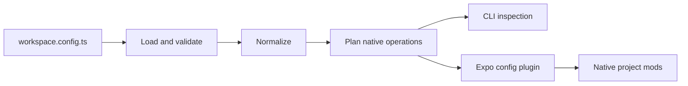

# Architecture

The repository has one publishable package, `packages/expo-native-config`, and six private sample apps. pnpm manages workspace dependencies and a shared catalog; samples consume the same public entry points as external users.

Configuration loading, schema validation, normalization, planning, and execution form separate boundaries. Runtime Zod schemas define the public data model before behavior is implemented. TypeScript types derive from these schemas where practical. The CLI and config plugin share the same validated configuration and planning behavior.

Internal engine modules divide iOS targets, Swift packages, CocoaPods, Xcode, Android, and file operations. They are implementation boundaries within one npm package, not independently published workspace packages. Consumers import helpers from the package root and the Expo plugin from `expo-native-config/plugin`.

Generators describe operations; executors apply them through Expo config-plugin mods. Operation IDs let users inspect an intended change with `explain`. Plans are semantic descriptions of desired work, not complete diffs against generated native projects. Config loading can execute JavaScript and TypeScript and therefore is not a sandbox.

Operations carry a `risk` level. Anything that rewrites generated Ruby, Groovy or entry-point source is marked `escape-hatch`: `plan` and `doctor` warn about it, because Expo's plugin guidance treats regular-expression rewrites of generated code as a last resort that breaks silently across SDK upgrades. Typed fields that map onto Expo's own introspectable mods are preferred wherever they can express the change.

Each generated block is tagged. A generator whose declaration disappears emits a removal operation for its tag rather than leaving the block behind, so removing configuration takes effect without a clean prebuild. The plugin entry point is wrapped in `createRunOncePlugin`, and config-plugins is resolved through the app's own `expo` package when one is present, so a second copy under pnpm cannot split the mod registry.

Native projects are generated outputs for these samples. App-owned source stays outside `ios/` and `android/` where possible. Changes should survive clean prebuild, and repeated prebuild should avoid duplicate owned blocks. Removal semantics and conflicts with other plugins need explicit tests rather than assumptions.

See [development rules](development-rules.md) for contributor boundaries and [compatibility](compatibility.md) for evidence requirements.
